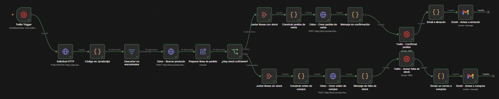
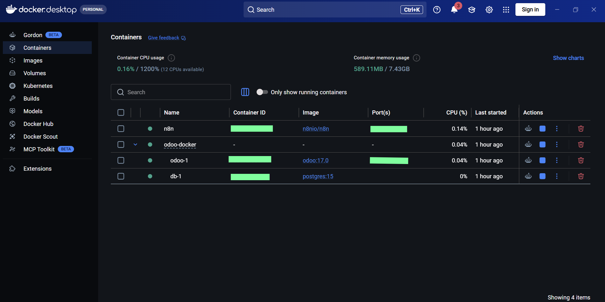
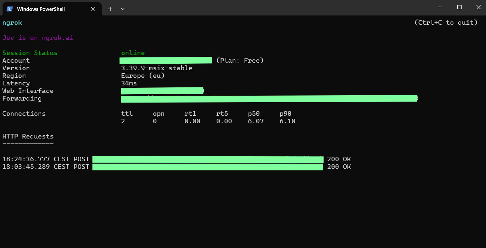
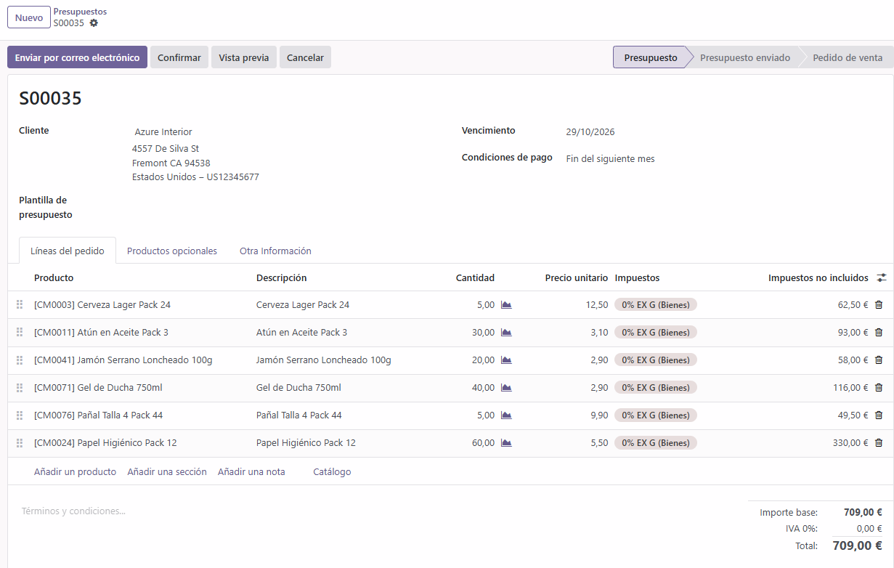
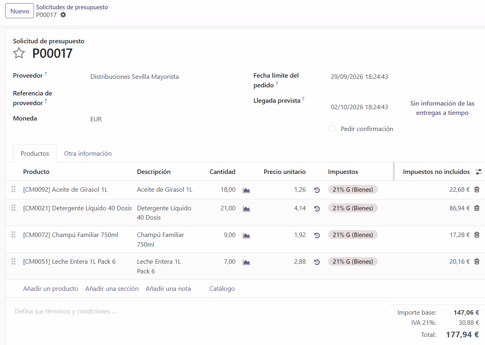
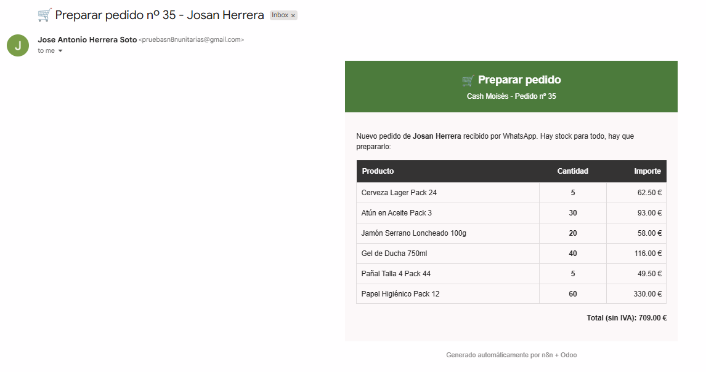
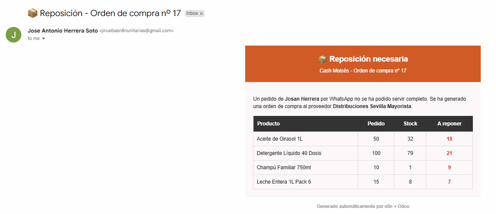

# Pedidos por WhatsApp con IA + Odoo + n8n

Proyecto de portfolio: un cliente envía un pedido por WhatsApp, una IA (Claude) lo 
interpreta y lo cruza con un catálogo de 100 productos, se consulta el stock real en 
un ERP (Odoo), y según haya existencias o no, el sistema decide solo entre generar un 
pedido de venta o una orden de compra al proveedor — avisando automáticamente al 
cliente, al almacén y a compras. Todo con un flujo de 21 nodos en n8n, sin intervención 
manual.

## El flujo completo

## Arquitectura

- **Docker Desktop** con Odoo 17 Community + PostgreSQL 15 + n8n, todo en local
- **ngrok** como puente, para que Twilio (WhatsApp) pueda alcanzar el n8n local desde internet
- **Claude API** (Anthropic) para interpretar el pedido en lenguaje natural
- **Twilio** (Sandbox de WhatsApp) para recibir y responder mensajes
- **Odoo** vía API JSON-RPC para consultar stock real y crear pedidos/órdenes de compra
- **Gmail API** para notificar a almacén y a compras

## Qué hace el flujo

1. **Recibe el pedido** por WhatsApp a través de Twilio
2. **Claude extrae** los productos y cantidades del texto libre del cliente
3. **Se cruza** cada producto con un catálogo de 100 productos (nombre + código interno)
4. **Se consulta el stock real** en Odoo para cada producto
5. **Si hay stock suficiente** → crea el pedido de venta en Odoo, confirma por WhatsApp 
   al cliente y avisa por email al almacén para que lo prepare
6. **Si no hay stock suficiente** → crea una orden de compra al proveedor en Odoo, 
   avisa por WhatsApp al cliente de la falta de stock y notifica por email a compras

## Resultado en Odoo

**Ventas** — pedido generado automáticamente con los productos disponibles:

**Compras** — orden de reposición generada automáticamente con lo que faltaba:

## Notificaciones automáticas

**Email a almacén**, para preparar el pedido:

**Email a compras**, con la reposición necesaria:

## Demo — flujo completo de principio a fin

*(Haz clic en el enlace para reproducir el vídeo: WhatsApp → n8n → Odoo → respuesta 
automática, todo en una sola toma)*

## Reto técnico principal

Odoo no expone una API REST convencional, sino **JSON-RPC** — un único endpoint 
(`/jsonrpc`) donde todo cambia según el `method` y los `args` del body. Además, el 
emparejamiento de productos no se hizo buscando texto libre directamente en Odoo (poco 
fiable con nombres parecidos, tildes o plurales), sino comparando el término extraído 
por la IA contra un catálogo normalizado en el propio flujo, antes de consultar el 
`id` exacto del producto en Odoo.

## Stack

Docker · Odoo 17 Community · PostgreSQL 15 · n8n · Claude API (Anthropic) · 
Twilio (WhatsApp) · Gmail API · JSON-RPC · ngrok

## Flujo n8n

El flujo exportado está disponible en este repositorio (`.json`), importable 
directamente en cualquier instancia de n8n.

---
Proyecto desarrollado como parte de mi portfolio en transición hacia automatización 
con IA y desarrollo de integraciones — [José Antonio Herrera Soto](https://github.com/JosanHerrera)
